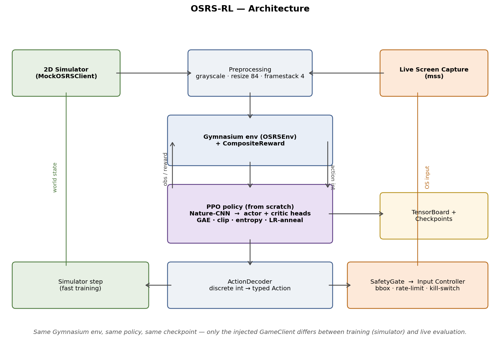

# OSRS-RL — Vision-Based Reinforcement Learning Agent

A PPO policy implemented from scratch learns to play Old School RuneScape
from raw pixels. Training runs against a custom 2D simulator through a
Gymnasium interface; evaluation runs end-to-end against the real game
through a safety-gated screen-capture and input pipeline. The same env,
the same policy, and the same checkpoint file drive both paths — only the
injected `GameClient` differs.



## Results

300k training steps (~5 min on a single CPU, `num_envs=8`), 50-episode
stochastic evaluation against a random-action baseline:

|                          | random  | **trained PPO**   |
| ------------------------ | ------- | ----------------- |
| episode return           | −2.90   | **+18.04**        |
| trees chopped / episode  | 2.24    | **3.92**          |
| idle-action share        | 14.1%   | **0.3%**          |
| DROP-action share        | 14.3%   | **0.0%**          |

Checkpoint progression shows return climbing from +9 at 25k steps to +25
at 300k — a clean, monotonic learning curve from raw pixel input.
Domain-randomized training more than doubles the trained-policy success
rate under perturbed visuals (baseline policy collapses to 0.0%; the
domain-randomized policy holds at 6.7%).

## Why this project matters

- **Mirrors the real autonomy stack** — perception → state → policy →
  action → reward → update — with a single `GameClient` seam that cleanly
  abstracts simulator training from real-game evaluation.
- **Sim-to-real infrastructure is built, not stubbed.** Live screen
  capture, safety-gated input control, kill-switch file, rate limiting,
  bounding-box enforcement, dry-run mode, per-action audit log.
- **Four ablation studies with shared seeds and hyperparameters**,
  including two rigorously documented negative results that sharpen the
  diagnosis rather than burying it.
- **PPO implemented from scratch** — Nature-CNN backbone, GAE(λ), clipped
  surrogate, advantage normalization, LR annealing, orthogonal init, plus
  a recurrent LSTM variant. Zero dependence on Stable-Baselines3.

## Key technical highlights

- **Custom PPO from scratch**, feedforward and recurrent (LSTM) variants,
  in one file — `src/osrs_rl/agents/ppo.py`.
- **Vision-based policy from raw pixels** — Nature-CNN backbone,
  frame-stacked inputs, orthogonal init.
- **Custom Gymnasium environment + 2D simulator** — ~1000 steps/sec per
  env, RGB-frame output matching real screen-capture format.
- **Composable reward system** — `RewardComponent` objects summed into a
  `CompositeReward`; adding a new reward is ~10 lines.
- **Live OSRS client with hard safety gates** — every mouse or keyboard
  action passes through a single `SafetyGate` enforcing opt-in,
  kill-switch, rate limit, bounding box, and audit log.
- **Domain randomization for sim-to-real robustness** — per-episode
  palette, HUD position, distractor clutter, and tree-size jitter;
  per-frame brightness, contrast, and Gaussian noise. All behind
  independent config flags.
- **Recurrent PPO ablation** — sequence-aware rollout buffer, per-step
  hidden-state reset at episode boundaries, env-partitioned minibatches.
  Tested with identical budget and seed vs the feedforward baseline.
  Falsified the "memory is the bottleneck" hypothesis.
- **Continuous integration** — GitHub Actions runs `ruff` and `pytest` on
  Python 3.10 and 3.11. 32 tests cover env, rewards, PPO, wrappers, live
  safety gates, and recurrent correctness.

## Architecture

Same Gymnasium env, same policy, same checkpoint format — only the
injected `GameClient` differs between simulator training and live
evaluation.

```
pixels → preprocess (grayscale, resize, framestack) → CNN → actor/critic
   ↑                                                            ↓
GameClient  ←  ActionDecoder  ←  discrete action  ←  sampled action
```

Two `GameClient` implementations ship:

- `MockOSRSClient` — fast 2D grid simulator used for training
- `LiveOSRSClient` — screen-capture + safety-gated input used for
  real-game evaluation

## Quickstart

```bash
python -m venv .venv && source .venv/bin/activate
pip install -e ".[dev]"

pytest -q                                         # 32 tests, ~3s
osrs-train --config configs/ppo_woodcutting.yaml  # train (~5 min)
osrs-eval  --checkpoint runs/ppo_woodcutting_v2/checkpoints/latest.pt \
           --episodes 50                           # evaluate
```

## Deep dive

For the full experiments, ablations, limitations, reproduction commands,
domain-randomization study, recurrent-PPO study, representation attack,
and honest interpretation of every result — see
**[TECHNICAL_REPORT.md](TECHNICAL_REPORT.md)**.

## License

MIT.
