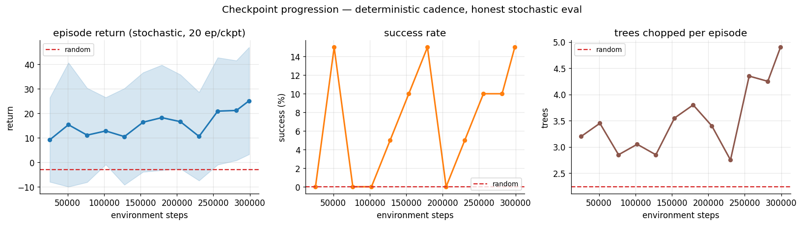
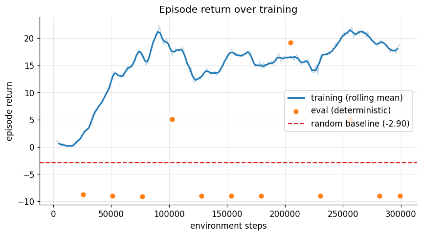
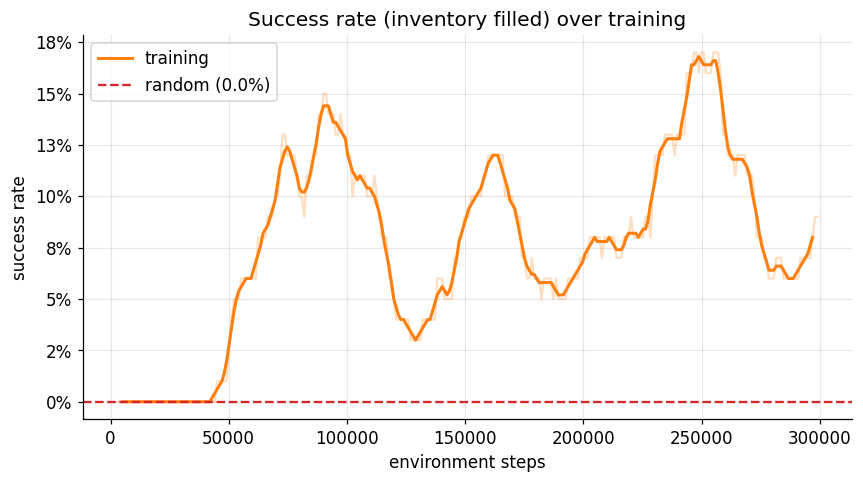
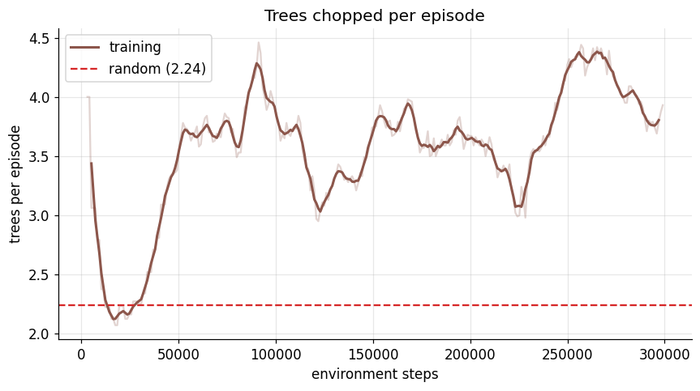
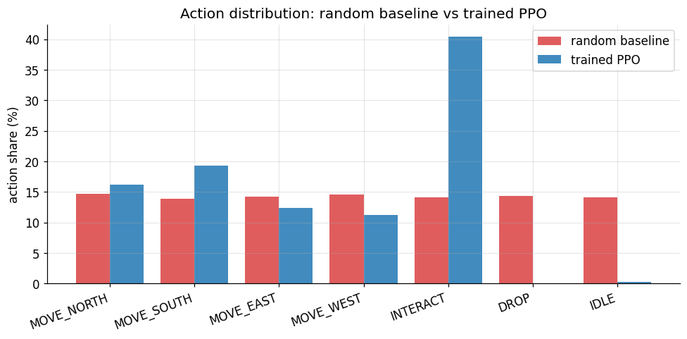
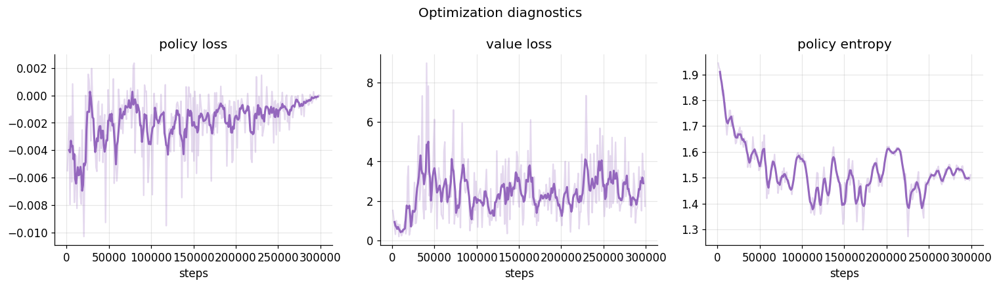

# OSRS-RL — Vision-Based Reinforcement Learning Agent

A portfolio-scale autonomy project: a **PPO policy (implemented from scratch)** learns
to play Old School RuneScape from raw pixels, trained against a fast 2D simulator and
evaluated end-to-end against the real game through a safety-gated input pipeline. The
same Gymnasium env, policy, and checkpoint file drive both paths — only the injected
`GameClient` differs.


## Results at a glance

Trained for 300k environment steps (~5 minutes on a single CPU, `num_envs=8`),
evaluated over 50 fresh episodes with stochastic policy sampling.

|                                 | random baseline | **trained PPO**                        |
| ------------------------------- | --------------- | -------------------------------------- |
| episode return                  | −2.90 ± 3.03    | **+18.04 ± 17.93**                     |
| trees chopped / episode         | 2.24            | **3.92**                               |
| success rate (inventory filled) | 0.0%            | **4% — peaks 15% at best checkpoints** |
| idle-action share               | 14.1%           | **0.3%**                               |
| DROP-action share               | 14.3%           | **0.0%**                               |

**Checkpoint progression** — independent 20-episode evaluations at each saved checkpoint,
zero data leakage between training and eval:



Return climbs from +9 at 25k steps to +25 at 300k (≈3×). Trees-per-episode rises from
3.2 to 4.9. Full plots and interpretation in [Results](#results).

## Quickstart

```bash
# 1. Install
python -m venv .venv && source .venv/bin/activate
pip install -e ".[dev]"

# 2. Smoke-test (17 tests, ~3s)
pytest -q

# 3. Train (~5 min on laptop CPU)
osrs-train --config configs/ppo_woodcutting.yaml

# 4. Evaluate random baseline + trained checkpoint
osrs-eval --random --episodes 30 \
          --output runs/baseline_random.json
osrs-eval --checkpoint runs/ppo_woodcutting_v2/checkpoints/latest.pt \
          --episodes 50 \
          --output runs/ppo_woodcutting_v2/eval_trained.json

# 5. Per-checkpoint progression eval + all README plots
python scripts/evaluate_checkpoints.py \
    --run-dir runs/ppo_woodcutting_v2 \
    --config configs/ppo_woodcutting.yaml --episodes 20
python scripts/plot_training.py \
    --run-dir runs/ppo_woodcutting_v2 \
    --baseline-json runs/baseline_random.json \
    --trained-json runs/ppo_woodcutting_v2/eval_trained.json \
    --progression-json runs/ppo_woodcutting_v2/checkpoint_progression.json

# 6. Live OSRS dry-run (no input sent)
pip install -e ".[live]"
osrs-eval --checkpoint runs/ppo_woodcutting_v2/checkpoints/latest.pt \
          --live-config configs/live.yaml --episodes 1
```

## Architecture

The pipeline mirrors the canonical autonomy stack _perception → state → policy → action
→ reward → update_:

- **Perception.** Raw RGB frames from either the 2D simulator or `mss` screen capture.
- **Preprocessing** (`src/osrs_rl/vision/preprocess.py`) — grayscale, resize to 84×84,
  stack the last 4 frames along the channel axis.
- **Gymnasium env** (`src/osrs_rl/env/osrs_env.py`) — wraps a `GameClient` and a
  `CompositeReward`. Exposes `Discrete(7)` actions.
- **PPO policy** (`src/osrs_rl/agents/ppo.py`) — Nature-CNN backbone → shared features →
  actor and critic heads with orthogonal init. Clipped objective, GAE(λ), advantage
  normalization, entropy bonus, LR annealing. No SB3 — every line is in the repo.
- **Rewards** (`src/osrs_rl/rewards/`) — composable `RewardComponent` objects summed
  into a `CompositeReward`: log-collected, step/invalid/idle penalties, distance
  shaping, adjacency bonus, full-inventory bonus.
- **Simulator** (`src/osrs_rl/env/simulator/mock_osrs.py`) — 2D grid OSRS-like
  woodcutting world at ~1000 steps/sec per env. Renders RGB frames at the native
  `grid_size × tile_size` resolution so the visual domain is deterministic and
  debuggable.
- **Live client** (`src/osrs_rl/env/live/live_client.py`) — same `GameClient`
  interface, backed by real screen capture and a `SafetyGate` that gates every
  cursor move, click, and keypress.

## Repository layout

```
src/osrs_rl/
├── env/              # Gymnasium env, GameClient interface
│   ├── simulator/    #   2D grid simulator (training)
│   └── live/         #   live OSRS client (evaluation)
├── vision/           # frame preprocessing + screen capture
├── input_control/    # mouse/keyboard controller + SafetyGate
├── rewards/          # composable reward components
├── agents/           # PPO (from scratch) + networks + rollout buffer
├── training/         # CLI entry point, trainer, checkpointing
├── evaluation/       # evaluation harness and metrics
└── utils/            # typed config, logging, seeding
configs/              # ppo_woodcutting.yaml, live.yaml
scripts/              # plot_training.py, evaluate_checkpoints.py, draw_architecture.py
tests/                # 17 tests — env / rewards / PPO / wrappers / live / safety
docs/                 # architecture.png
```

## Results

### Episode return over training



Rolling-mean training return climbs from the random-baseline line (−2.90) to above +15
within 25k steps and stabilizes around +17. The orange dots at −9 are the trainer's
deterministic-argmax evals — see [Limitations](#limitations) for why those stay flat
while the stochastic policy improves dramatically.

### Success rate and trees chopped




### What the policy learned



The trained agent triples INTERACT share vs random, eliminates DROP entirely, drops
IDLE from 14% → 0.3%, and develops a directional navigation bias (MOVE_SOUTH ~2×
MOVE_WEST) — a spatial feature the CNN learned from the training-time tree layouts.

### Optimization diagnostics



Policy loss near zero (expected for PPO's clipped objective), bounded value loss,
entropy anneals from ~1.9 (uniform) to ~1.5 (committed but still exploring).

### Why PPO works here

The task has a moderately sparse but dense-enough reward (+5 per log, with
potential-based distance shaping) and a small discrete action space. PPO's clipped
objective gives stable improvement without the replay-buffer dynamics that make DQN
sensitive to reward scale and exploration schedule. The CNN backbone learns a useful
spatial representation even at 84×84 grayscale because the semantic units (agent,
tree, stump, HUD bar) are color-separated and tile-aligned. Tree layouts are freshly
randomized on every reset, so the policy cannot memorize — it is learning a
navigation-plus-interact behavior conditioned on current visual state.

## Limitations

Stated honestly rather than hidden:

1. **Deterministic argmax collapses to 100% INTERACT.** The top logit is usually
   INTERACT; movement emerges only from stochastic sampling. A well-trained policy
   would put INTERACT on top _only when a tree is adjacent_. The shared-backbone
   actor doesn't yet separate those two visual states reliably — a representation
   bottleneck, not a reward bottleneck. This is the single biggest structural tell in
   the results.
2. **Success-rate plateau at 10–15%.** Filling inventory needs 10 chops in 300 steps;
   the agent averages 4. The gap is post-chop navigation after tree respawns.
3. **Adjacency-bonus reward did less than expected.** A second training (`v2`) with
   an explicit `+0.5` "became adjacent to a live tree" bonus raised mean return from
   +14.3 to +18.0 but did not lift success rate — confirming the representation
   diagnosis above.
4. **Sim-to-real visual gap is wide.** The simulator's pixel statistics share almost
   nothing with the real OSRS client. The live path (M5) is an infrastructure
   demonstration — closing the visual gap is a dedicated training problem ([Next
   steps](#next-steps-sim-to-real)).
5. **Live evaluation is read-only by default.** `enable_live_input=false` means the
   whole stack runs end-to-end against the live window with zero OS-level side
   effects. Real input requires an explicit config flip and is bounded by a
   bbox + rate limit + kill-switch file.

## Live OSRS evaluation

The live client implements `GameClient` so the trained checkpoint runs against the
real game with zero code changes to training/eval. Every OS-level side effect flows
through `SafetyGate`:

1. `enable_live_input` must be `true` (default `false` → every action is audit-logged
   but blocked at dispatch).
2. Kill-switch file — presence of `/tmp/osrs_rl_stop` denies every subsequent action.
3. Rate limit (`max_actions_per_second`).
4. Safe bounding box — any move or click whose target falls outside is denied.
5. Audit log for every approved _and_ denied action.

```bash
# Dry-run — validates the capture region and audit log, sends no input
osrs-eval --checkpoint runs/ppo_woodcutting_v2/checkpoints/latest.pt \
          --live-config configs/live.yaml --episodes 1

# Real-input — flip enable_live_input: true in configs/live.yaml first,
# then prepare the kill switch in another terminal:
#   touch /tmp/osrs_rl_stop   # halt immediately
#   rm    /tmp/osrs_rl_stop   # resume
osrs-eval --checkpoint runs/ppo_woodcutting_v2/checkpoints/latest.pt \
          --live-config configs/live.yaml --episodes 1
```

macOS users: `mss` needs Screen Recording permission and `pynput` needs Accessibility
permission for the terminal (System Settings → Privacy & Security).

## Next steps: sim-to-real

Closing the visual-domain gap is the natural next milestone. In priority order:

1. **Domain randomization in the simulator** — randomize tile sizes, colors, HUD
   position, lighting noise, clutter. Train the policy to be invariant to the exact
   pixel statistics of any single renderer.
2. **Recurrent policy head (GRU/LSTM).** Addresses the representation bottleneck
   directly by giving the policy multi-frame memory — which tree am I walking toward,
   is the chop animation still running.
3. **Real-frame fine-tuning.** Collect a few hundred labeled OSRS screenshots
   (tree / no-tree, adjacent / not), add a lightweight supervised aux-loss on the CNN
   backbone during PPO training so the visual features transfer.
4. **CV-based action decoder.** Instead of a naive virtual cursor, have the live
   client detect tree pixels and expose a "click nearest tree" macro as an action —
   the policy then only has to choose _when_, not _where_.
5. **Curriculum: `grid_size=8 → 16`, simulator resolution 84 → 128 RGB**, widening
   the backbone. Cleaner single-task proof before sim-to-real.

## Roadmap

- [x] Gymnasium env, custom PPO, 2D simulator
- [x] Evaluation harness, random baseline, progression plots, action-distribution chart
- [x] Live OSRS client with safety-gated input and dry-run by default
- [x] CI (GitHub Actions) + architecture diagram + README polish
- [ ] Domain randomization + recurrent policy
- [ ] DQN baseline behind the same `BasePolicy` interface
- [ ] Second task (combat? mining?) as generalization test

## License

MIT.
