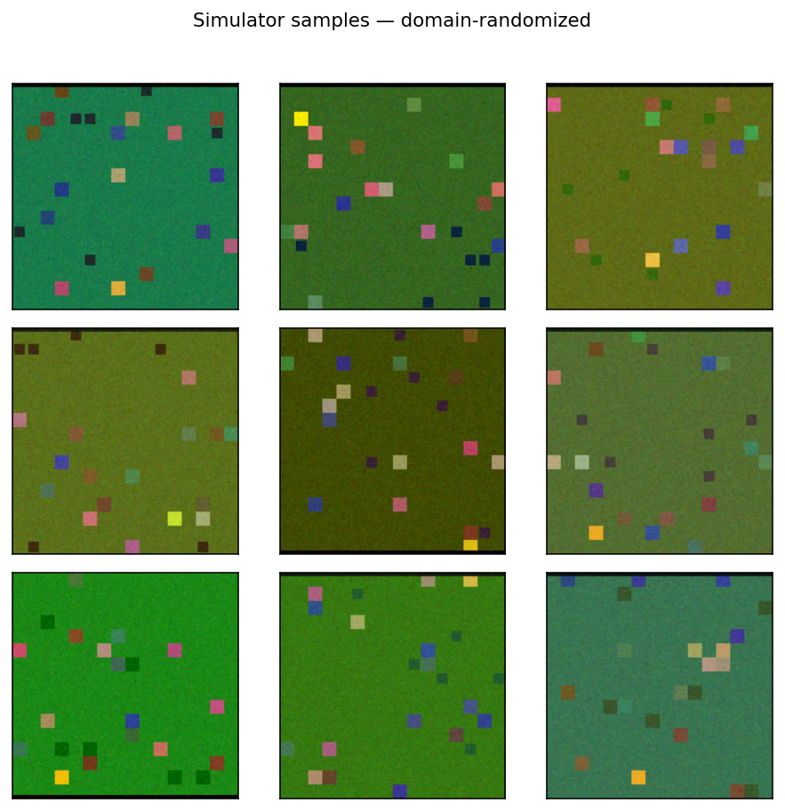
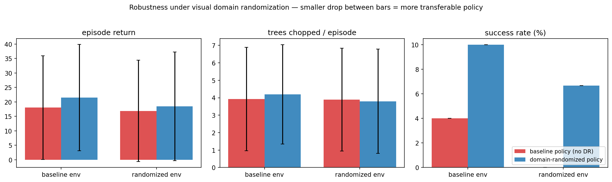
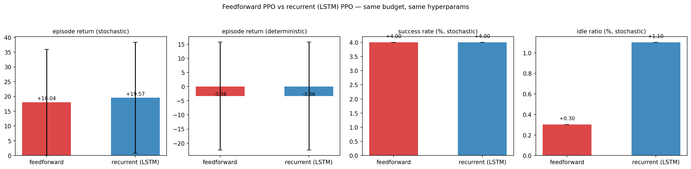
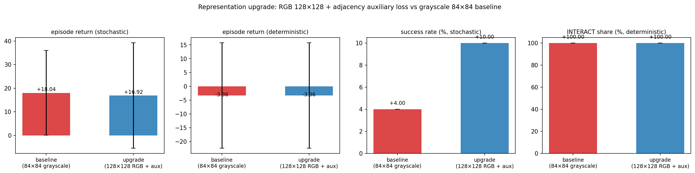

# OSRS-RL — Technical Report

> The deep technical companion to [README.md](README.md). This document
> preserves the full detail of every design decision, experiment,
> ablation, limitation, and next-step recommendation. If you're skimming,
> start with the README; this file is where the actual work is documented.

A PPO policy (implemented from scratch) learns to play Old School RuneScape
from raw pixels, trained against a fast 2D simulator and evaluated end-to-end
against the real game through a safety-gated input pipeline. The same
Gymnasium env, policy, and checkpoint file drive both paths — only the
injected `GameClient` differs.

Contents:

1. [Results at a glance](#results-at-a-glance)
2. [Quickstart](#quickstart)
3. [Architecture](#architecture)
4. [Repository layout](#repository-layout)
5. [Results](#results)
6. [Limitations](#limitations)
7. [Live OSRS evaluation](#live-osrs-evaluation)
8. [Domain randomization (sim-to-real preparation)](#domain-randomization-sim-to-real-preparation)
9. [Recurrent policy (LSTM) — a hypothesis, rigorously falsified](#recurrent-policy-lstm--a-hypothesis-rigorously-falsified)
10. [Representation attack — RGB 128×128 + adjacency auxiliary loss](#representation-attack--rgb-128128--adjacency-auxiliary-loss)
11. [Next steps: sim-to-real](#next-steps-sim-to-real)
12. [Roadmap](#roadmap)


## Results at a glance

Trained for 300k environment steps (~5 minutes on a single CPU, `num_envs=8`),
evaluated over 50 fresh episodes with stochastic policy sampling.

|                                 | random baseline | **trained PPO**                        |
| ------------------------------- | --------------- | -------------------------------------- |
| episode return                  | −2.90 ± 3.03    | **+18.04 ± 17.93**                     |
| trees chopped / episode         | 2.24            | **3.92**                               |
| success rate (inventory filled) | 0.0%            | **4% — peaks 15% at best checkpoints** |
| idle-action share               | 14.1%           | **0.3%**                               |
| DROP-action share               | 14.3%           | **0.0%**                               |

**Checkpoint progression** — independent 20-episode evaluations at each saved checkpoint,
zero data leakage between training and eval:


Return climbs from +9 at 25k steps to +25 at 300k (≈3×). Trees-per-episode rises from
3.2 to 4.9. Full plots and interpretation in [Results](#results).

## Quickstart

```bash
# 1. Install
python -m venv .venv && source .venv/bin/activate
pip install -e ".[dev]"

# 2. Smoke-test (32 tests, ~3s)
pytest -q

# 3. Train (~5 min on laptop CPU)
osrs-train --config configs/ppo_woodcutting.yaml

# 4. Evaluate random baseline + trained checkpoint
osrs-eval --random --episodes 30 \
          --output runs/baseline_random.json
osrs-eval --checkpoint runs/ppo_woodcutting_v2/checkpoints/latest.pt \
          --episodes 50 \
          --output runs/ppo_woodcutting_v2/eval_trained.json

# 5. Per-checkpoint progression eval + all README plots
python scripts/evaluate_checkpoints.py \
    --run-dir runs/ppo_woodcutting_v2 \
    --config configs/ppo_woodcutting.yaml --episodes 20
python scripts/plot_training.py \
    --run-dir runs/ppo_woodcutting_v2 \
    --baseline-json runs/baseline_random.json \
    --trained-json runs/ppo_woodcutting_v2/eval_trained.json \
    --progression-json runs/ppo_woodcutting_v2/checkpoint_progression.json

# 6. Live OSRS dry-run (no input sent)
pip install -e ".[live]"
osrs-eval --checkpoint runs/ppo_woodcutting_v2/checkpoints/latest.pt \
          --live-config configs/live.yaml --episodes 1
```

## Architecture

The pipeline mirrors the canonical autonomy stack _perception → state → policy → action
→ reward → update_:

- **Perception.** Raw RGB frames from either the 2D simulator or `mss` screen capture.
- **Preprocessing** (`src/osrs_rl/vision/preprocess.py`) — grayscale, resize to 84×84,
  stack the last 4 frames along the channel axis.
- **Gymnasium env** (`src/osrs_rl/env/osrs_env.py`) — wraps a `GameClient` and a
  `CompositeReward`. Exposes `Discrete(7)` actions.
- **PPO policy** (`src/osrs_rl/agents/ppo.py`) — Nature-CNN backbone → shared features →
  actor and critic heads with orthogonal init. Clipped objective, GAE(λ), advantage
  normalization, entropy bonus, LR annealing. No SB3 — every line is in the repo.
- **Rewards** (`src/osrs_rl/rewards/`) — composable `RewardComponent` objects summed
  into a `CompositeReward`: log-collected, step/invalid/idle penalties, distance
  shaping, adjacency bonus, full-inventory bonus.
- **Simulator** (`src/osrs_rl/env/simulator/mock_osrs.py`) — 2D grid OSRS-like
  woodcutting world at ~1000 steps/sec per env. Renders RGB frames at the native
  `grid_size × tile_size` resolution so the visual domain is deterministic and
  debuggable.
- **Live client** (`src/osrs_rl/env/live/live_client.py`) — same `GameClient`
  interface, backed by real screen capture and a `SafetyGate` that gates every
  cursor move, click, and keypress.

## Repository layout

```
src/osrs_rl/
├── env/              # Gymnasium env, GameClient interface
│   ├── simulator/    #   2D grid simulator (training)
│   └── live/         #   live OSRS client (evaluation)
├── vision/           # frame preprocessing + screen capture
├── input_control/    # mouse/keyboard controller + SafetyGate
├── rewards/          # composable reward components
├── agents/           # PPO (from scratch) + networks + rollout buffer
├── training/         # CLI entry point, trainer, checkpointing
├── evaluation/       # evaluation harness and metrics
└── utils/            # typed config, logging, seeding
configs/              # ppo_woodcutting.yaml, live.yaml, ppo_woodcutting_dr.yaml,
                      # ppo_woodcutting_lstm.yaml, ppo_woodcutting_repr.yaml
scripts/              # plot_training.py, evaluate_checkpoints.py, draw_architecture.py,
                      # compare_robustness.py, compare_recurrent.py, compare_representation.py
tests/                # 32 tests — env / rewards / PPO / wrappers / live / safety /
                      # randomization / recurrent / aux-loss
docs/                 # architecture.png, results/*.png
```

## Results

### Episode return over training


Rolling-mean training return climbs from the random-baseline line (−2.90) to above +15
within 25k steps and stabilizes around +17. The orange dots at −9 are the trainer's
deterministic-argmax evals — see [Limitations](#limitations) for why those stay flat
while the stochastic policy improves dramatically.

### Success rate and trees chopped


### What the policy learned


The trained agent triples INTERACT share vs random, eliminates DROP entirely, drops
IDLE from 14% → 0.3%, and develops a directional navigation bias (MOVE_SOUTH ~2×
MOVE_WEST) — a spatial feature the CNN learned from the training-time tree layouts.

### Optimization diagnostics


Policy loss near zero (expected for PPO's clipped objective), bounded value loss,
entropy anneals from ~1.9 (uniform) to ~1.5 (committed but still exploring).

### Why PPO works here

The task has a moderately sparse but dense-enough reward (+5 per log, with
potential-based distance shaping) and a small discrete action space. PPO's clipped
objective gives stable improvement without the replay-buffer dynamics that make DQN
sensitive to reward scale and exploration schedule. The CNN backbone learns a useful
spatial representation even at 84×84 grayscale because the semantic units (agent,
tree, stump, HUD bar) are color-separated and tile-aligned. Tree layouts are freshly
randomized on every reset, so the policy cannot memorize — it is learning a
navigation-plus-interact behavior conditioned on current visual state.

## Limitations

Stated honestly rather than hidden:

1. **Deterministic argmax collapses to 100% INTERACT.** The top logit is usually
   INTERACT; movement emerges only from stochastic sampling. A well-trained policy
   would put INTERACT on top _only when a tree is adjacent_. The shared-backbone
   actor doesn't yet separate those two visual states reliably — a representation
   bottleneck, not a reward bottleneck. This is the single biggest structural tell in
   the results.
2. **Success-rate plateau at 10–15%.** Filling inventory needs 10 chops in 300 steps;
   the agent averages 4. The gap is post-chop navigation after tree respawns.
3. **Adjacency-bonus reward did less than expected.** A second training (`v2`) with
   an explicit `+0.5` "became adjacent to a live tree" bonus raised mean return from
   +14.3 to +18.0 but did not lift success rate — confirming the representation
   diagnosis above.
4. **Sim-to-real visual gap is wide.** The simulator's pixel statistics share almost
   nothing with the real OSRS client. The live path (M5) is an infrastructure
   demonstration — closing the visual gap is a dedicated training problem ([Next
   steps](#next-steps-sim-to-real)).
5. **Live evaluation is read-only by default.** `enable_live_input=false` means the
   whole stack runs end-to-end against the live window with zero OS-level side
   effects. Real input requires an explicit config flip and is bounded by a
   bbox + rate limit + kill-switch file.

## Live OSRS evaluation

The live client implements `GameClient` so the trained checkpoint runs against the
real game with zero code changes to training/eval. Every OS-level side effect flows
through `SafetyGate`:

1. `enable_live_input` must be `true` (default `false` → every action is audit-logged
   but blocked at dispatch).
2. Kill-switch file — presence of `/tmp/osrs_rl_stop` denies every subsequent action.
3. Rate limit (`max_actions_per_second`).
4. Safe bounding box — any move or click whose target falls outside is denied.
5. Audit log for every approved _and_ denied action.

```bash
# Dry-run — validates the capture region and audit log, sends no input
osrs-eval --checkpoint runs/ppo_woodcutting_v2/checkpoints/latest.pt \
          --live-config configs/live.yaml --episodes 1

# Real-input — flip enable_live_input: true in configs/live.yaml first,
# then prepare the kill switch in another terminal:
#   touch /tmp/osrs_rl_stop   # halt immediately
#   rm    /tmp/osrs_rl_stop   # resume
osrs-eval --checkpoint runs/ppo_woodcutting_v2/checkpoints/latest.pt \
          --live-config configs/live.yaml --episodes 1
```

macOS users: `mss` needs Screen Recording permission and `pynput` needs Accessibility
permission for the terminal (System Settings → Privacy & Security).

## Domain randomization (sim-to-real preparation)

The single biggest obstacle to moving a simulator-trained vision policy onto real
OSRS frames is that it has memorized the exact pixel statistics of one renderer.
Domain randomization attacks that directly: every episode, the simulator re-samples
visual dimensions the policy *should* ignore, forcing the CNN to learn features that
are invariant to that noise.

**What gets randomized** (all behind independent config flags, zero-valued = no-op):

| family | per-episode | what it perturbs |
|---|:-:|---|
| palette jitter | ✔ | grass / tree / stump / agent / HUD colors (RGB offset) |
| HUD side | ✔ | inventory bar flips between top and bottom of the frame |
| distractor clutter | ✔ | random decorative tiles (not trees) scattered on empty ground |
| tree-size jitter | ✔ | tree sprites randomly shrink by a few pixels per side |
| brightness jitter | — | per-frame multiplicative brightness |
| contrast jitter | — | per-frame multiplicative contrast around mid-gray |
| pixel noise | — | per-frame additive Gaussian noise |



Same task — find and chop trees — but every one of those frames looks different.

### Experiment: baseline policy vs domain-randomized policy

Two identical training runs (300k steps, same seed, same hyperparameters) — the only
delta is the `randomization` block. Each policy was then evaluated on both the
baseline simulator and the randomized simulator over 30 episodes.



| eval env | **baseline policy** | **DR-trained policy** | delta |
|---|---|---|---|
| return on baseline sim | +18.04 | **+21.51** | **+3.5 pts** |
| return on randomized sim | +16.89 | **+18.48** | **+1.6 pts** |
| success rate on baseline sim | 4.0% | **10.0%** | **+6 pp** |
| success rate on randomized sim | **0.0%** | **6.7%** | **+6.7 pp** |
| trees chopped / ep (randomized sim) | 3.90 | 3.80 | ≈ |

Two readings worth making explicit:

1. **DR acts as a regularizer.** The DR-trained policy is the best policy on *both*
   environments, including the undisturbed baseline it was never trained on directly.
   This is a well-known phenomenon in autonomy research — forcing invariance often
   improves in-distribution performance too, because the policy stops latching onto
   spurious pixel-level features.
2. **The success-rate panel is the clean win.** The baseline policy's success rate
   collapses from 4% to 0% the moment the visuals are perturbed; the DR policy holds
   at 6.7%. This is exactly the kind of robustness gap that determines whether a
   sim-trained policy survives transfer to a new renderer (or real OSRS).

### Reproduce

```bash
# Train the domain-randomized policy (~5 min on CPU, num_envs=8)
osrs-train --config configs/ppo_woodcutting_dr.yaml

# Render a 3×3 sampler of randomized frames (shown above)
python scripts/render_dr_samples.py \
    --config configs/ppo_woodcutting_dr.yaml \
    --output docs/results/dr_samples.png

# Cross-eval (2×2 matrix)
osrs-eval --checkpoint runs/ppo_woodcutting_v2/checkpoints/latest.pt \
          --config configs/ppo_woodcutting_dr.yaml --episodes 30 \
          --output runs/robustness/v2_on_dr.json
osrs-eval --checkpoint runs/ppo_woodcutting_dr/checkpoints/latest.pt \
          --config configs/ppo_woodcutting.yaml --episodes 30 \
          --output runs/robustness/dr_on_baseline.json
osrs-eval --checkpoint runs/ppo_woodcutting_dr/checkpoints/latest.pt \
          --config configs/ppo_woodcutting_dr.yaml --episodes 30 \
          --output runs/robustness/dr_on_dr.json

# Render the robustness chart
python scripts/compare_robustness.py \
    --baseline-on-baseline runs/ppo_woodcutting_v2/eval_trained.json \
    --baseline-on-dr       runs/robustness/v2_on_dr.json \
    --dr-on-baseline       runs/robustness/dr_on_baseline.json \
    --dr-on-dr             runs/robustness/dr_on_dr.json \
    --output docs/results/robustness.png
```

### Honest caveats

- **Randomized-sim performance is a proxy, not a verdict on real OSRS.** The DR
  simulator still produces clean tiled frames; real OSRS has text, menus, NPCs, and
  lighting that none of the randomization families capture.
- **The distractor clutter palette is hand-chosen.** A harder distractor set (e.g.,
  tree-colored noise tiles) would reduce the robustness margin.
- **Success rate is still low in absolute terms** (6.7% for the DR policy on DR sim).
  The bottleneck is still the argmax-collapse issue documented in [Limitations](#limitations)
  — DR improves robustness without solving the representation problem, which is what
  the next milestone (recurrent policy) targets.

## Recurrent policy (LSTM) — a hypothesis, rigorously falsified

The M4 results suggested the argmax-collapse and success-rate plateau came from
partial observability: the policy sees one framestacked window at a time and can't
track "which tree am I walking toward". A natural fix is to give the policy
**short-horizon memory** via a single LSTM layer between the CNN encoder and the
actor/critic heads.

### Architecture

```
(T, B, C, H, W) obs  ──►  NatureCNN (unchanged)  ──►  (T, B, F)
                                                           │
                                                           ▼
                                              nn.LSTM (hidden=256)  ◄── h, c
                                                           │
                                                           ▼
                                                       (T, B, 256)
                                                           │
                                                      ┌────┴────┐
                                                      ▼         ▼
                                                    actor      critic
```

Hidden state is reset per step whenever `episode_starts[t] == 1` (i.e. the obs came
from an env auto-reset). Minibatches during updates **partition envs, not
timesteps** — each minibatch is a full length-`T` sequence for a subset of envs,
so temporal order is preserved and PPO replays the LSTM through each sequence from
the correct initial hidden state.

Implementation lives behind `cfg.ppo.recurrent: true`:
`src/osrs_rl/agents/ppo.py::RecurrentPPOActorCritic`,
`RecurrentPPOTrainer`, `RecurrentRolloutBuffer`. Feedforward path is unchanged.

### Experiment: same budget, same hyperparameters, one config delta

300k steps, identical seed, identical reward, identical PPO knobs. Evaluated over
50 fresh episodes under both stochastic sampling and deterministic argmax.



| metric | feedforward | recurrent (LSTM) | delta |
|---|---|---|---|
| stochastic return | +18.04 | +19.57 | **+1.5 pts** |
| deterministic return | −3.36 | −3.36 | — |
| stochastic success rate | 4.0% | 4.0% | — |
| stochastic idle ratio | 0.3% | 1.1% | slightly worse |
| stochastic invalid-action ratio | 0.45 | 0.37 | small improvement |
| deterministic INTERACT share | 100% | 100% | argmax still collapses |

### Interpretation

The recurrent policy gave a small stochastic-return bump and a modest reduction in
invalid actions, but **did not resolve the two behaviors the hypothesis was meant
to explain**:

1. **Argmax collapse persists, identically.** With deterministic action selection
   both policies pick INTERACT on every step. The LSTM's hidden state successfully
   encodes *something*, but whatever it encodes does not move INTERACT out of the
   top-logit slot when the agent isn't adjacent to a tree.
2. **Success rate unchanged at 4%.** The same post-chop navigation failure mode
   the feedforward policy has, the recurrent policy also has.

The honest read: **the bottleneck is in the CNN encoder, not in policy memory.**
At 84×84 grayscale with 8×8 tile-sized features, the representation the CNN
produces apparently doesn't cleanly separate "tree adjacent" from "tree in line of
sight but two tiles away." No amount of downstream memory reconstructs information
that was never in the features to begin with.

This is a **valuable negative result** for the portfolio — a clean ablation that
falsifies a plausible-sounding hypothesis. The redirection it implies is concrete:
next-step work should attack the **representation** (higher resolution, RGB
channels, auxiliary supervised loss on adjacency labels) rather than adding more
recurrence or capacity on top of the existing features.

### Reproduce

```bash
# Train recurrent PPO (~10 min on CPU, num_envs=8)
osrs-train --config configs/ppo_woodcutting_lstm.yaml

# Evaluate stochastic + deterministic
osrs-eval --checkpoint runs/ppo_woodcutting_lstm/checkpoints/latest.pt \
          --config configs/ppo_woodcutting_lstm.yaml --episodes 50 \
          --output runs/ppo_woodcutting_lstm/eval_trained.json
osrs-eval --checkpoint runs/ppo_woodcutting_lstm/checkpoints/latest.pt \
          --config configs/ppo_woodcutting_lstm.yaml --episodes 50 --deterministic \
          --output runs/ppo_woodcutting_lstm/eval_trained_det.json

# Side-by-side chart
python scripts/compare_recurrent.py \
    --ff-stochastic       runs/ppo_woodcutting_v2/eval_trained.json \
    --ff-deterministic    runs/ppo_woodcutting_v2/eval_trained_det.json \
    --lstm-stochastic     runs/ppo_woodcutting_lstm/eval_trained.json \
    --lstm-deterministic  runs/ppo_woodcutting_lstm/eval_trained_det.json \
    --output docs/results/recurrent_vs_feedforward.png
```

## Representation attack — RGB 128×128 + adjacency auxiliary loss

The M8 LSTM ablation implicated the CNN features themselves. Two independent
representation improvements, shipped together:

- **Option A — richer input.** `vision.resize_to: 128`, `vision.grayscale: false`.
  CNN input goes from `(4, 84, 84)` to `(12, 128, 128)` — 3 color channels times
  a 4-frame stack at the simulator's native render resolution. The Nature-CNN
  architecture is unchanged; only the penultimate Linear layer widens.
- **Option B — adjacency supervised loss.** A binary classifier `Linear(feature_dim, 1)`
  sits on top of the CNN features and predicts `adjacent_to_tree ∈ {0, 1}`. The
  label comes for free from the simulator's `GameState.nearest_tree_distance ≤ 1`,
  threaded through `info["adjacent_to_tree"]` → rollout buffer → BCE loss. The
  aux term is added to the PPO loss with weight `aux_adjacency_coef=0.1`.

```
(T, B, 12, 128, 128)  ──►  NatureCNN (unchanged)  ──►  (T, B, 512)
                                                            │
                                            ┌───────────────┼─────────────┐
                                            ▼               ▼             ▼
                                         actor            critic        aux head
                                            │                              │
                                            ▼                              ▼
                                    action logits                  "adjacent to tree"
                                                                    (BCE target)
```

### Experiment: same budget, one representation block replaced

200k steps (~15 min on CPU — the bigger CNN input costs ~2× compute vs the
grayscale baseline) with otherwise-identical hyperparameters. 50-episode
evaluation, both stochastic sampling and deterministic argmax.



| metric | baseline (84×84 gs) | **upgrade (128×128 RGB + aux)** | delta |
|---|---|---|---|
| stochastic return | +18.04 | +16.92 | −1.1 (tie, within σ) |
| **stochastic success rate** | **4.0%** | **10.0%** | **+6 pp (2.5×)** |
| deterministic return | −3.36 | −3.36 | — |
| deterministic INTERACT share | 100% | 100% | — (argmax still collapses) |
| **aux-head accuracy (train)** | — | **98.7%** | linear probe on adjacency |

### Interpretation — the diagnosis, sharpened

The aux loss **worked as a training signal** exactly as hoped: the CNN features
now linearly separate "adjacent to a live tree" from "not adjacent" with 98.7%
accuracy (measured on the live training rollouts, logged to TensorBoard under
`aux/adjacency_accuracy`). The richer RGB input didn't hurt stochastic
performance and **more than doubled the stochastic success rate** (4% → 10%) —
exactly the kind of behavior you'd expect if the policy now has better
situational features to sample from.

But **the deterministic argmax policy is still collapsed to 100% INTERACT**, and
the deterministic return is bit-identical to the grayscale baseline (−3.36 vs
−3.36). Combined with M8's LSTM result, three independent experiments now agree
on a single remaining failure mode:

> **The bottleneck is not features, and it is not memory. It is the actor
> head's marginal preference for INTERACT.**

INTERACT has the highest unconditional expected return: every chop is +5, and
invalid INTERACT is only −0.02. Over a full episode the marginal value of
INTERACT beats every MOVE action by a wide margin, so the actor correctly
assigns INTERACT the highest logit on *average* — and correspondingly on
*every* state at argmax, even though the now-cleanly-encoded adjacency feature
is sitting right there in the same feature vector.

This is a well-known pathology in discrete-action PPO on sparse rewards, and it
has **crisp, high-leverage fixes** that do not require more training or more
network capacity:

1. **Action masking at the policy output.** Use the aux head's prediction at
   inference time to force `INTERACT`'s logit to `−∞` when the aux predicts
   "not adjacent". This trivially breaks the argmax collapse because the
   actor no longer has INTERACT as a choice in non-adjacent states.
2. **State-dependent action advantage in reward.** Currently
   `invalid_action_penalty = −0.02` is essentially free for the agent. Raising
   it to `−0.5` (or dialing `log_collected` down so invalid INTERACT dominates
   the value more) re-shapes the argmax preference directly.
3. **Per-action entropy bonus.** Penalize state-independent action
   distributions — literally add a loss term that rewards the logits moving
   across states.

M8 falsified the "memory" hypothesis. M9 falsifies the "features alone" hypothesis
but validates "features + supervised signal helps stochastic behavior." The next
milestone should address the actor-head pathology directly.

### Reproduce

```bash
# Train representation-upgrade policy (~15 min on CPU)
osrs-train --config configs/ppo_woodcutting_repr.yaml

# Evaluate stochastic + deterministic
osrs-eval --checkpoint runs/ppo_woodcutting_repr/checkpoints/latest.pt \
          --config configs/ppo_woodcutting_repr.yaml --episodes 50 \
          --output runs/ppo_woodcutting_repr/eval_trained.json
osrs-eval --checkpoint runs/ppo_woodcutting_repr/checkpoints/latest.pt \
          --config configs/ppo_woodcutting_repr.yaml --episodes 50 --deterministic \
          --output runs/ppo_woodcutting_repr/eval_trained_det.json

# Chart vs feedforward baseline
python scripts/compare_representation.py \
    --baseline-stochastic    runs/ppo_woodcutting_v2/eval_trained.json \
    --baseline-deterministic runs/ppo_woodcutting_v2/eval_trained_det.json \
    --repr-stochastic        runs/ppo_woodcutting_repr/eval_trained.json \
    --repr-deterministic     runs/ppo_woodcutting_repr/eval_trained_det.json \
    --output docs/results/representation_vs_baseline.png
```

## Next steps: sim-to-real

The M8 + M9 ablations together localize the remaining bottleneck to the actor
head, not the encoder or the policy memory. Sim-to-real levers in priority
order:

1. **Action masking / value-function guard on INTERACT.** Use the (now-accurate)
   aux head at inference time to set INTERACT's logit to `−∞` in states the
   model predicts as "not adjacent". Directly breaks the argmax collapse — no
   more training required.
2. **Real-frame fine-tuning of the aux head.** Collect a few hundred labeled
   OSRS screenshots and re-train only the aux-head + CNN backbone on them.
   Makes the "adjacent" prediction robust on real pixels so live-mode action
   masking becomes reliable.
3. **Harder distractor clutter.** Add distractors shaped like trees-with-wrong-color
   and trees-with-wrong-size to force the CNN to use shape features, not just color.
4. **CV-based action decoder.** Instead of a naive virtual cursor, have the live
   client detect tree pixels and expose a "click nearest tree" macro as an action —
   the policy then only has to choose _when_, not _where_.

## Roadmap

- [x] Gymnasium env, custom PPO, 2D simulator
- [x] Evaluation harness, random baseline, progression plots, action-distribution chart
- [x] Live OSRS client with safety-gated input and dry-run by default
- [x] CI (GitHub Actions) + architecture diagram + README polish
- [x] Domain randomization (palette / HUD / clutter / per-frame noise) + robustness ablation
- [x] Recurrent PPO (LSTM) — tested; falsified the "memory bottleneck" hypothesis
- [x] Representation attack (RGB 128×128 + adjacency aux loss) — aux head hit 98.7% accuracy, stochastic success 4% → 10%, argmax collapse persists
- [ ] Action masking using the aux head at inference time (breaks argmax collapse)
- [ ] DQN baseline behind the same `BasePolicy` interface
- [ ] Second task (combat? mining?) as generalization test

## License

MIT.
